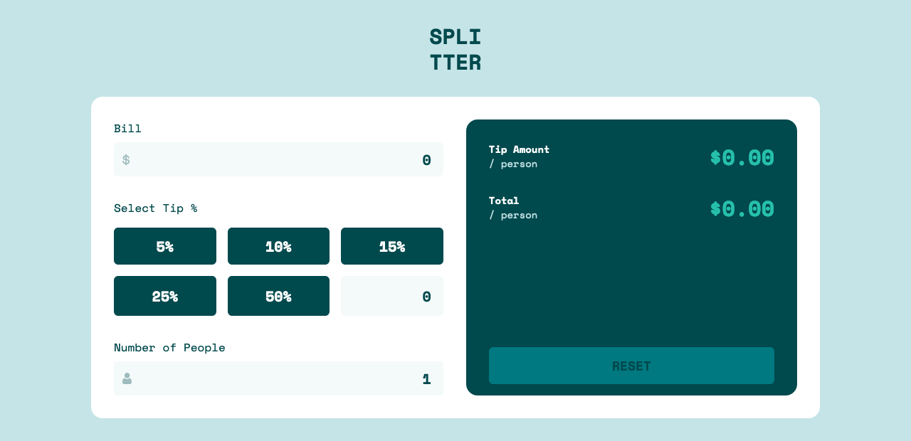
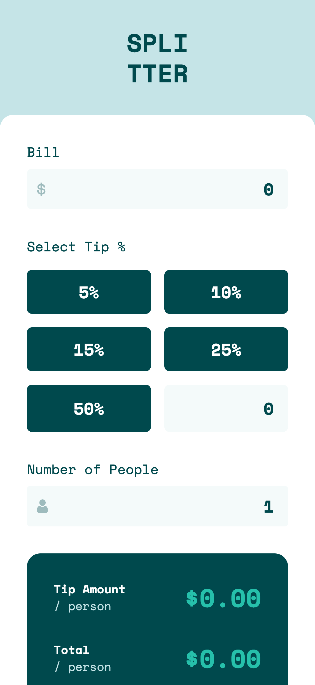

# Frontend Mentor - Tip calculator app solution

This is a solution to the [Tip calculator app challenge on Frontend Mentor](https://www.frontendmentor.io/challenges/tip-calculator-app-ugJNGbJUX). Frontend Mentor challenges help you improve your coding skills by building realistic projects.

## Table of contents

- [Overview](#overview)
  - [The challenge](#the-challenge)
  - [Screenshot](#screenshot)
  - [Links](#links)
- [My process](#my-process)
  - [Built with](#built-with)
- [Author](#author)

## Overview

## The challenge

Your challenge is to build out this tip calculator app and get it looking as close to the design as possible.

You can use any tools you like to help you complete the challenge. So if you've got something you'd like to practice, feel free to give it a go.

Your users should be able to:

- View the optimal layout for the app depending on their device's screen size
- See hover states for all interactive elements on the page
- Calculate the correct tip and total cost of the bill per person

### Screenshot

### Links

- Solution URL: [github repo](https://github.com/Nabster2010/frontend-mentor-tip-calculator)
- Live Site URL: [live site](https://gifted-boyd-7b5465.netlify.app/)

## My process

### Built with

- Semantic HTML5 markup
- tailwind css
- react
- Flexbox
- Mobile-first workflow

## Author

- Frontend Mentor - [@Nabster2010](https://www.frontendmentor.io/profile/Nabster2010)
- Twitter - [@yMahmoudElGarhey](https://www.twitter.com/MahmoudElGarhey)
